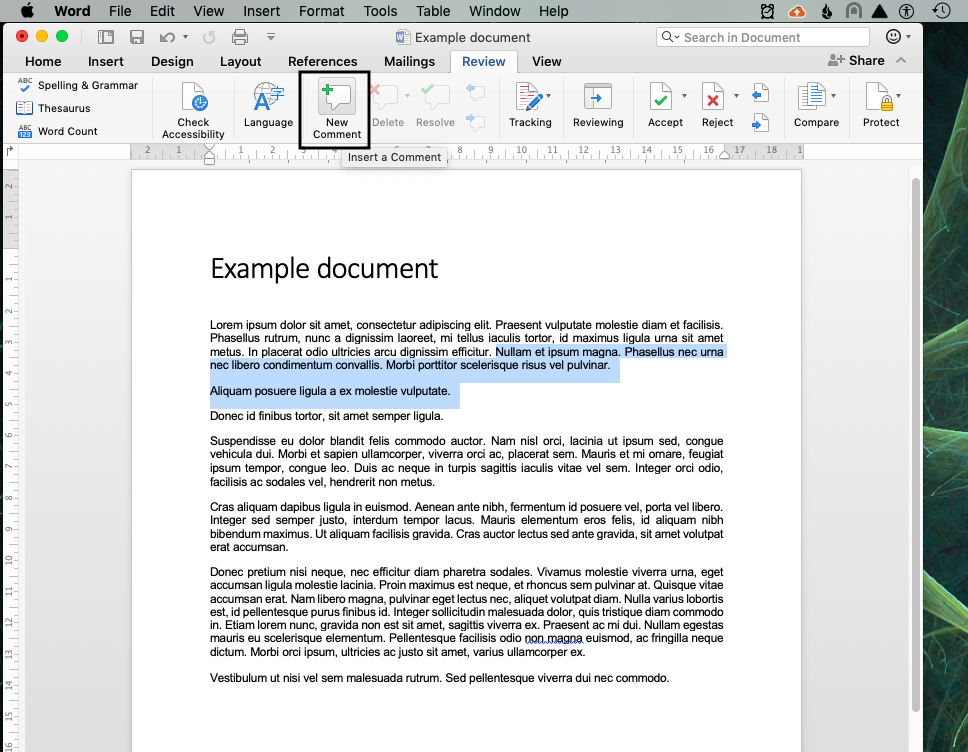
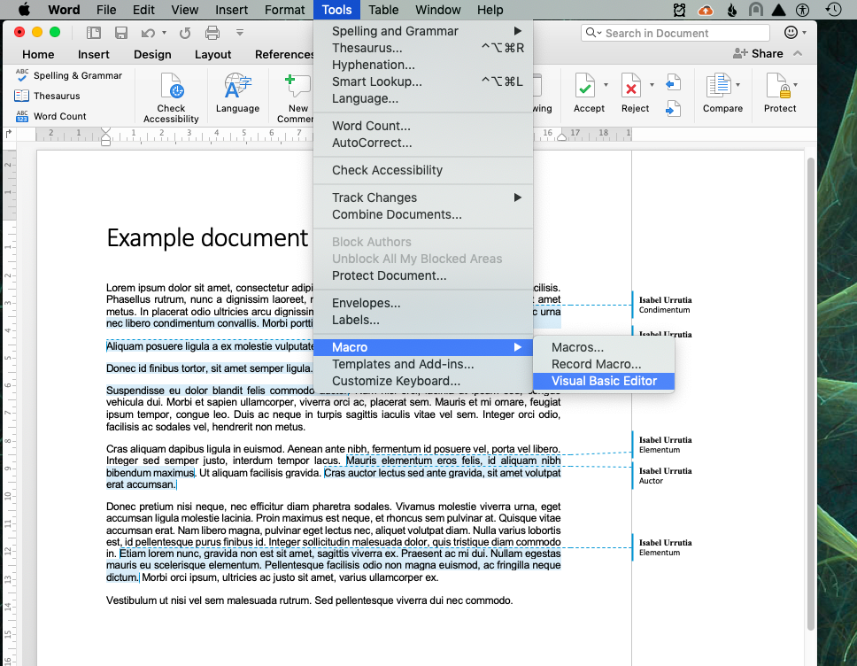
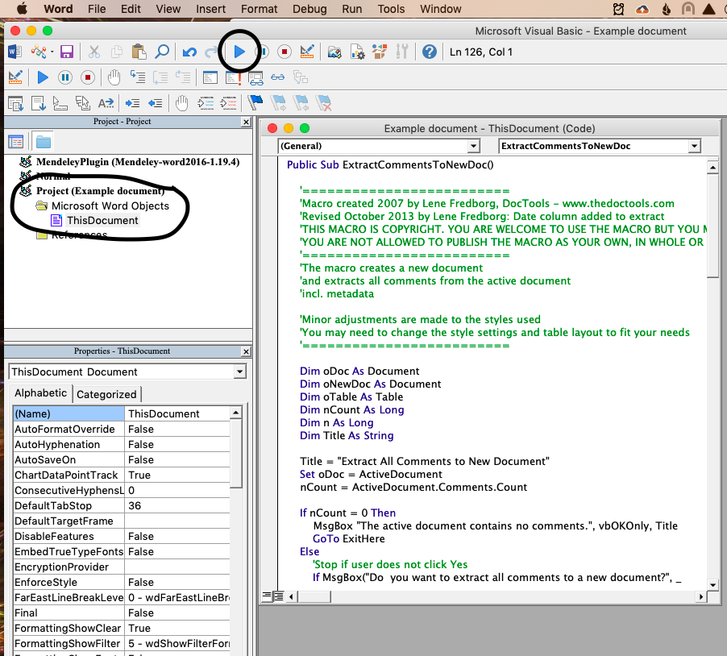
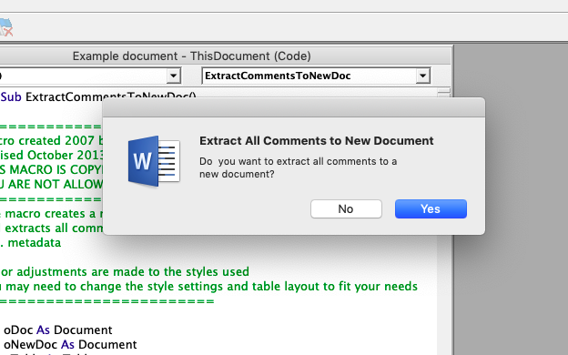
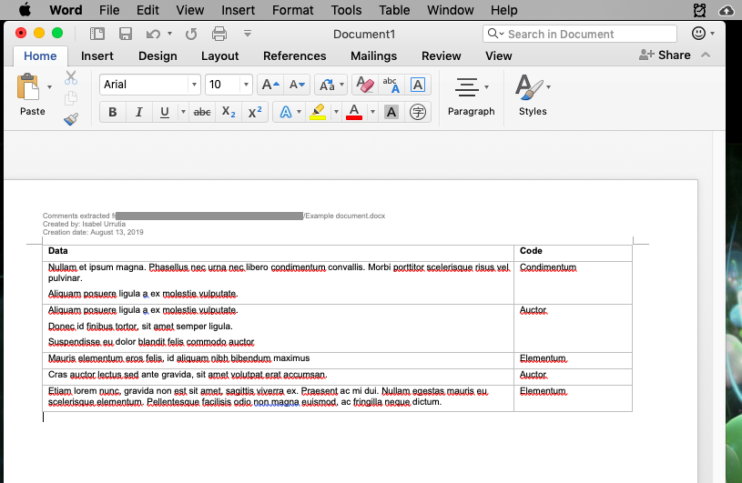
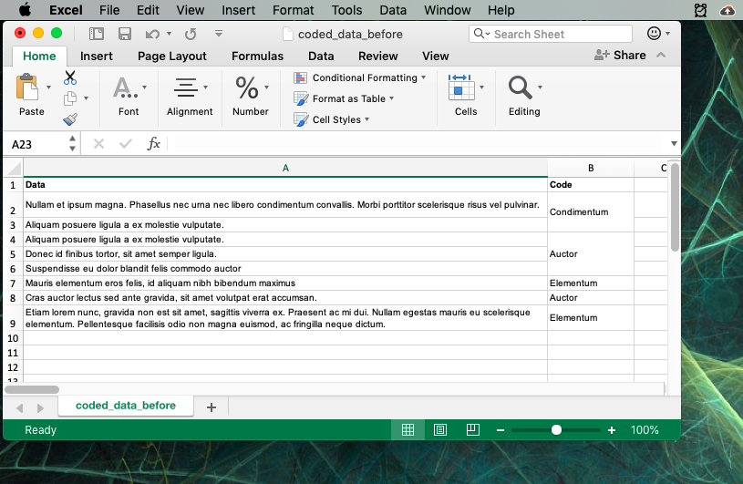
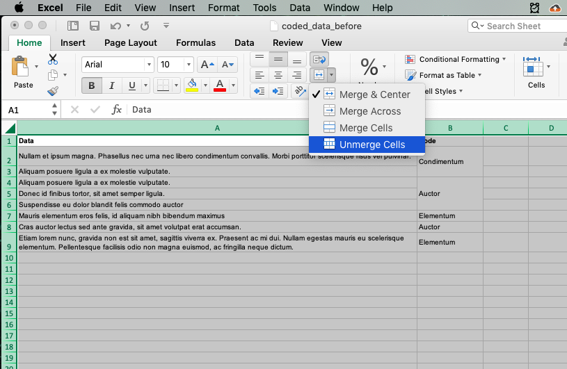
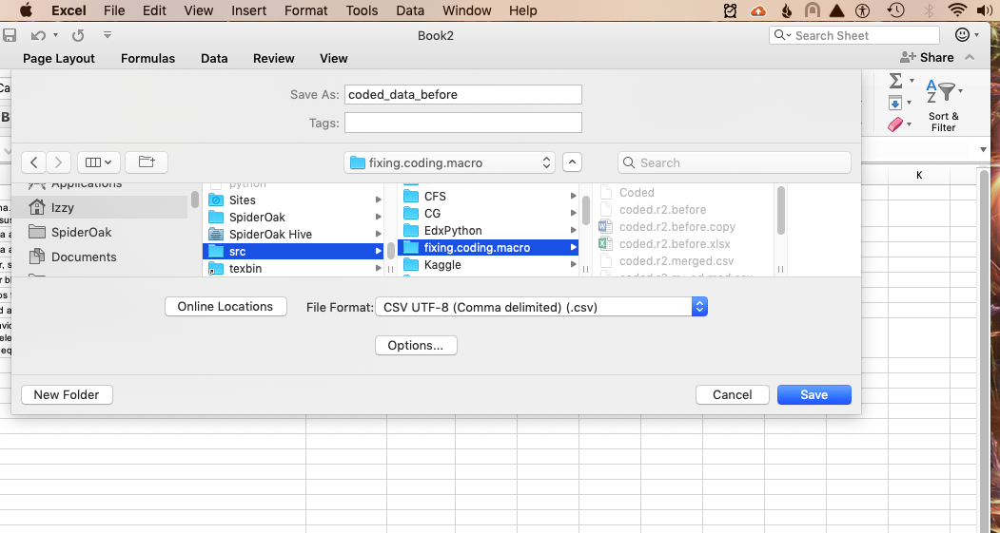
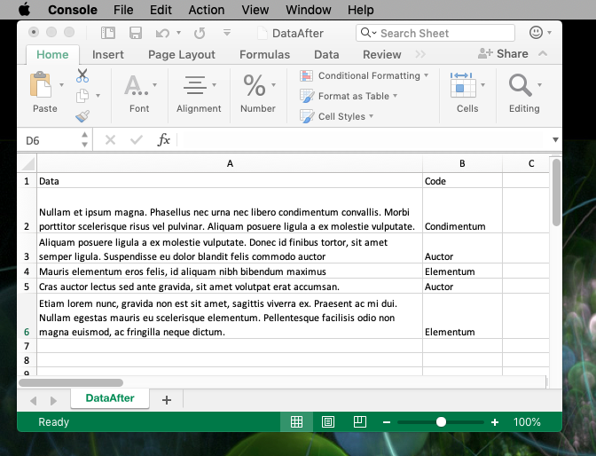

# Qualitative Coding with the Lene Fredborg's DocTools Microsoft Word Macro

These notes are aimed at qualitatitive researchers looking for a free alternative to NVivo or Atlas.

This document details step by step instructions to use Microsoft Word's comment feature to code qualititative data. These instructions are not detailed, and assume that the reader is comfortable with the basics of using Microsoft software (importing and exporting tables into Excel to and from csv formats) and running Python script locally.

This is done by using a modified version of a **macro created by Lene Fredborg, DocTools** - www.thedoctools.com, and some Python code that help to reformat the resulting table.

I used the steps outlined here using Microsoft Word for Mac vs. 16.16.12. 


## Q&A

**What is qualitative coding?**

It depends on who you ask. (What their background and theoretical framework is; what type of data they wish to analyze; what their research questions is.) I am partial to Coffey and Atkinson's view on quantitative coding: Coding is the practice of attaching tags and labels to data. Researchers may choose these tags and labels (or *codes*) based on their research question, their theoretical framework, they may develop their codes iteratively as they examine the data, or through a combination of strategies. 

Coded data can then be used to link and relate bits of tagged text to each other. Coding and retrieving text allows the qualitative researcher to perform the analytical work of linking, relating, and identifying relevant themes in their data. In short, Coffey and Atkinson view qualitative coding as a supportive tool in qualitative data analysis, rather than  analysis in itself. 

I also tend to use *coding together with memoing* – that is, as I code I note my thoughts in a document of memos. In this memo document, I jot down thoughts that I have as I code (before I forget them) such as patterns that I want to go back and check later, ideas about what some of the central themes in my data might be, etc. Additionally, I take note of the parts of my data that are difficult to code because data that resists being boxed into one category or another is sometimes analytically interesting – data that is resistant to coding can lead to new insights!

Coffey, A., & Atkinson, P. (1996). Concepts and Coding. *In Making Sense of Qualitative Data* (pp. 26–53). Sage Publications.


**Why code with Microsoft Word comments? Advantages and limitations.**

There are many software options for qualitative coding, but most of these options are expensive!
Some of the better known ones you might have heard of are [NVivo](https://www.qsrinternational.com/nvivo/home), [MAXQDA](https://www.maxqda.com/) and [Atlas.ti](https://atlasti.com/).

The advantage of coding with Microsoft Word is that if you already own a Microsoft Office licence, then this method costs nothing. Other software options offer some fancy UI options that are not available using Microsoft Word comment coding, such as nested codes. Some people may find it advantageous to organize their codes in levels (e.g. primary codes, secondary codes, tertiary codes, etc). Using the macro will result in only one level of codes. However, as we are working with csv files, it is easy enough to add a new column to our table to introduce more structure and organization to our codes. Most other functions that are available in other qualitative software options can be emulated with basic search functions. If you are working with very large data sets, it might be helpful to write some fancier query functions to look through your data.


## How does coding with Microsoft Word comments work?


### 1. Have your data in a Microsoft Word document.

### 2. Code your data using the Microsoft Word comment feature.

To add a tag (code) to a data fragment, select a part of the data and annotate it with a comment. The comment text should be the code that you wish to assign to the data selected. A data fragment may be assigned more than one code.

I generally open a file that contains the codes alongside the word document that is being coded so that I am reminded of the codes I am using, and so that I don't make any typos as I code.



### 3. Run the DocTools macro (below).

This step will produce a new Word document that contains a table. The table organizes your data by the codes attached to each data fragment.

- To run the macro in my version of Microsoft Word, I select Tools > Macro > Visual Basic Editor on the menu bar. This opens a new Visual Basic Editor window.



- On the lefthand side you should see a panel of projects, listing your Word documents. Find your document in the list of projects ("Project (Document Name)") and double click it to see the contents of the project.
- There should be a folder titled "Microsoft Word Objects" in the Project folder, containing a file called "This Document". Paste the DocTools Macro into this file.



- Run the macro by selecting the blue triangle ("Run Macro") or by selecting Run > Macro from the menu bar.



- This generates a new word document with a table in it.



### 4. Clean up the formatting.

The table generated in step 3 is nice, but it would be good to be able to sort the table so we could, for example, see all the data tagged with the same code together. We could do this, for example, in Excel. The  problem is that that if we paste the table into Excel, and then try to sort the table by the Code column, we get an error message. This is because the table that the macro separates text with paragraph breaks into different rows. 

[This code](https://github.com/iurrutia/CQ_with_Word_Macro/blob/master/CleaningCSV.py) will clean up the produced as follows:

- Paste your table into Excel.



- Select the table and unmerge the table cells.



- Save the table as a csv file (into the same folder as the Python code).



- Run the [Python code](https://github.com/iurrutia/CQ_with_Word_Macro/blob/master/CleaningCSV.py). This code will create a new csv file. 

### 5. Link, relate, and retrieve.

Now you have a searchable, resortable csv file with your coded data. You can either work directly with this csv file to look at your data, or open it in Excel. Good luck and happy analyzing!



## Other resources

There are other tutorials that walk through the process of using Microsoft Word's comment feature for coding, such as [this write-up](https://carstenknoch.com/2018/02/qualitative-data-analysis-using-microsoft-word-comments/) or [this video](https://www.youtube.com/watch?v=TbjfpEe4j5Y).


## The Macro 

The Macro is can be found [here](https://github.com/iurrutia/CQ_with_Word_Macro/blob/master/ExtractCommentsMacro.vb) or below:


```
Public Sub ExtractCommentsToNewDoc()

    '=========================
    'Macro created 2007 by Lene Fredborg, DocTools - www.thedoctools.com
    'Revised October 2013 by Lene Fredborg: Date column added to extract
    'THIS MACRO IS COPYRIGHT. YOU ARE WELCOME TO USE THE MACRO BUT YOU MUST KEEP THE LINE ABOVE.
    'YOU ARE NOT ALLOWED TO PUBLISH THE MACRO AS YOUR OWN, IN WHOLE OR IN PART.
    '=========================
    'This version of the macro was modified in 2019 by Isabel Urrutia   
    '=========================
    'The macro creates a new document
    'and extracts all comments from the active document
    'incl. metadata
    
    'Minor adjustments are made to the styles used
    'You may need to change the style settings and table layout to fit your needs
    '=========================

    Dim oDoc As Document
    Dim oNewDoc As Document
    Dim oTable As Table
    Dim nCount As Long
    Dim n As Long
    Dim Title As String
    
    Title = "Extract All Comments to New Document"
    Set oDoc = ActiveDocument
    nCount = ActiveDocument.Comments.Count
    
    If nCount = 0 Then
        MsgBox "The active document contains no comments.", vbOKOnly, Title
        GoTo ExitHere
    Else
        'Stop if user does not click Yes
        If MsgBox("Do  you want to extract all comments to a new document?", _
                vbYesNo + vbQuestion, Title) <> vbYes Then
            GoTo ExitHere
        End If
    End If
        
    Application.ScreenUpdating = False
    'Create a new document for the comments, base on Normal.dotm
    Set oNewDoc = Documents.Add
    'Set to landscape
    oNewDoc.PageSetup.Orientation = wdOrientLandscape
    'Insert a 2-column table for the comments
    With oNewDoc
        .Content = ""
        Set oTable = .Tables.Add _
            (Range:=Selection.Range, _
            NumRows:=nCount + 1, _
            NumColumns:=2)
    End With
    
    'Insert info in header - change date format as you wish
    oNewDoc.Sections(1).Headers(wdHeaderFooterPrimary).Range.Text = _
        "Comments extracted from: " & oDoc.FullName & vbCr & _
        "Created by: " & Application.UserName & vbCr & _
        "Creation date: " & Format(Date, "MMMM d, yyyy")
            
    'Adjust the Normal style and Header style
    With oNewDoc.Styles(wdStyleNormal)
        .Font.Name = "Arial"
        .Font.Size = 10
        .ParagraphFormat.LeftIndent = 0
        .ParagraphFormat.SpaceAfter = 6
    End With
    
    With oNewDoc.Styles(wdStyleHeader)
        .Font.Size = 8
        .ParagraphFormat.SpaceAfter = 0
    End With

    'Format the table appropriately
    With oTable
        .Range.Style = wdStyleNormal
        .AllowAutoFit = False
        .PreferredWidthType = wdPreferredWidthPercent
        .PreferredWidth = 100
        .Columns.PreferredWidthType = wdPreferredWidthPercent
        .Columns(1).PreferredWidth = 80
        .Columns(2).PreferredWidth = 20
        .Rows(1).HeadingFormat = True
    End With

    'Insert table headings
    With oTable.Rows(1)
        .Range.Font.Bold = True
        .Cells(1).Range.Text = "Data"
        .Cells(2).Range.Text = "Code"
    End With
    
    'Get info from each comment from oDoc and insert in table
    For n = 1 To nCount
        With oTable.Rows(n + 1)
            'The text marked by the comment (data fragment)
            .Cells(1).Range.Text = oDoc.Comments(n).Scope
            'The comment itself (the code)
            .Cells(2).Range.Text = oDoc.Comments(n).Range.Text
        End With
    Next n
    
    Application.ScreenUpdating = True
    Application.ScreenRefresh
        
    oNewDoc.Activate
    MsgBox nCount & " comments found. Finished creating comments document.", vbOKOnly, Title

ExitHere:
    Set oDoc = Nothing
    Set oNewDoc = Nothing
    Set oTable = Nothing
    
End Sub

```
